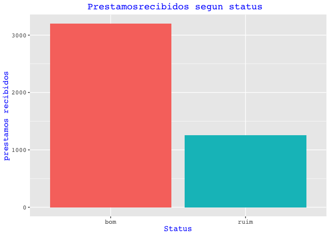
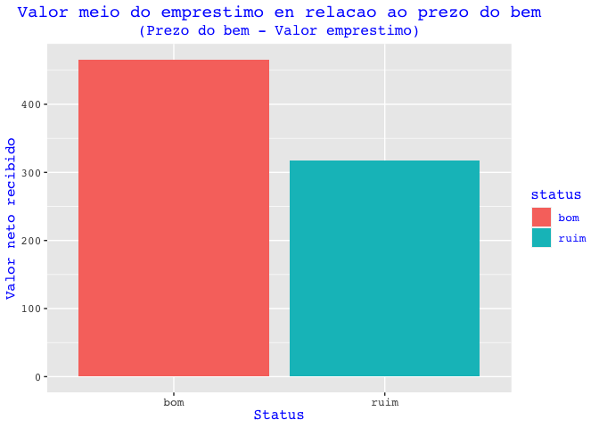
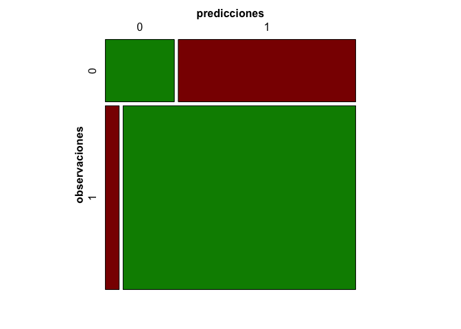

<!-- README.md is generated from README.Rmd. Please edit that file -->

``` r
library(tidyverse)
credito <- read_rds("data/credito.rds")
```

# NovoProjeto

<!-- badges: start -->

<!-- badges: end -->

EL objetivo de NovoProjecto es un ejemplo de analisis de la base de
datos credito y responder a las siguientes propuestas de anlisis:

  - Avaliar quais características definem um cliente bom ou ruim
  - Construir um modelo para prever clientes bons e ruins

### 1- Porque a classificação entre RUIN e BOM e importante

``` r
migraf1<-credito %>% 
  group_by(status) %>%
  summarise(qtd=n()) 
migraf1%>%
  ggplot() +
  geom_col(
    aes(x = status, y = qtd, fill = status),
    show.legend = FALSE
  )+
  labs(
    x="Status",
    y="prestamos recibidos",
    title = "Prestamosrecibidos segun status ")+
  theme(
  plot.title = element_text(hjust = 0.5),
  plot.subtitle = element_text(hjust = 0.5),
  text=element_text(size=12, family="mono", colour = "blue")
  )           


migraf2<-credito %>% 
  mutate(dif=preco_do_bem-valor_emprestimo) %>%
  group_by(status) %>% 
  summarise(media_dif=mean(dif)) 
migraf2%>%
  ggplot()+
  geom_col(aes(x=status, y=media_dif, fill=status))+
  labs(
    x="Status",
    y="Valor neto recibido",
    title = "Valor meio do emprestimo en relacao ao prezo do bem",
    subtitle = "(Prezo do bem - Valor emprestimo)")+
  theme(
  plot.title = element_text(hjust = 0.5),
  plot.subtitle = element_text(hjust = 0.5),
  text=element_text(size=12, family="mono", colour = "blue")
  )           
```



Os gráficos sugerem que a classificação “BOM” facilita o acesso a
empréstimos e a um valor concedido maior em relação ao valor do bem

### 2- Avaliar quais características definem um cliente BOM ou RUIM

``` r

mitabla<-credito %>% 
  mutate(status=if_else(status=="bom",1,0),balance=renda-despesas)

mod_logit <-glm(status ~ idade+tempo_empresa+moradia+estado_civil+
                  trabalho+balance+ativos+dividas, data=mitabla, family="binomial")
#mod_logit %>% summary() %>% knitr::kable(caption = "Legenda", digits=2) %>% 
mod_logit %>% summary() 
#> 
#> Call:
#> glm(formula = status ~ idade + tempo_empresa + moradia + estado_civil + 
#>     trabalho + balance + ativos + dividas, family = "binomial", 
#>     data = mitabla)
#> 
#> Deviance Residuals: 
#>     Min       1Q   Median       3Q      Max  
#> -3.2434  -0.7116   0.5187   0.7443   1.7884  
#> 
#> Coefficients:
#>                             Estimate Std. Error z value Pr(>|z|)    
#> (Intercept)                1.066e-01  2.198e-01   0.485 0.627723    
#> idade                     -1.365e-02  4.907e-03  -2.782 0.005405 ** 
#> tempo_empresa              7.803e-02  7.527e-03  10.367  < 2e-16 ***
#> moradiaoutras             -1.476e-01  1.603e-01  -0.921 0.357241    
#> moradiapais                5.128e-01  1.294e-01   3.962 7.44e-05 ***
#> moradiapriv                6.044e-02  1.735e-01   0.348 0.727587    
#> moradiaprópria             8.068e-01  1.091e-01   7.393 1.43e-13 ***
#> estado_civildivorciada(o) -6.643e-01  3.954e-01  -1.680 0.092927 .  
#> estado_civilseparada(o)   -1.002e+00  2.146e-01  -4.668 3.05e-06 ***
#> estado_civilsolteira(o)   -9.528e-03  1.154e-01  -0.083 0.934200    
#> estado_civilviúva(o)      -3.280e-01  3.264e-01  -1.005 0.315015    
#> trabalhofixo               3.946e-01  1.112e-01   3.548 0.000389 ***
#> trabalhomeio período      -8.968e-01  1.480e-01  -6.058 1.38e-09 ***
#> trabalhooutros             4.898e-02  2.176e-01   0.225 0.821888    
#> balance                    5.141e-03  6.784e-04   7.577 3.53e-14 ***
#> ativos                     1.822e-05  7.170e-06   2.542 0.011030 *  
#> dividas                   -1.603e-04  3.911e-05  -4.098 4.17e-05 ***
#> ---
#> Signif. codes:  0 '***' 0.001 '**' 0.01 '*' 0.05 '.' 0.1 ' ' 1
#> 
#> (Dispersion parameter for binomial family taken to be 1)
#> 
#>     Null deviance: 4549.5  on 4019  degrees of freedom
#> Residual deviance: 3891.6  on 4003  degrees of freedom
#>   (434 observations deleted due to missingness)
#> AIC: 3925.6
#> 
#> Number of Fisher Scoring iterations: 5
```

``` r
a<-tibble(
  Factores_positivos     = c("tempo_empresa","moradia pais" , "moradia própria", 
                             "trabalho fixo", "balance positivo", "ativos"),
  Factores_negativos     =c( "estado civil separado", "estado civil divorciado", 
                             "trabalho meio período", "idade", "dividas"," " ),
  Factores_non_influentes=c( "moradia outras", "moradia priv","estado civil solteiro",
                             "estado civil viúvo", "trabalho outros"," ")
)
```

``` r
a %>% knitr::kable(col.names = gsub("[_]", " ", names(a)), caption = "") 
```

| Factores positivos | Factores negativos      | Factores non influentes |
| :----------------- | :---------------------- | :---------------------- |
| tempo\_empresa     | estado civil separado   | moradia outras          |
| moradia pais       | estado civil divorciado | moradia priv            |
| moradia própria    | trabalho meio período   | estado civil solteiro   |
| trabalho fixo      | idade                   | estado civil viúvo      |
| balance positivo   | dividas                 | trabalho outros         |
| ativos             |                         |                         |

``` r
library(vcd)
predicciones <- ifelse(test = mod_logit$fitted.values > 0.5, yes = 1, no = 0)
matriz_confusion <- table(mod_logit$model$status, predicciones,
                          dnn = c("observaciones", "predicciones"))
matriz_confusion
#>              predicciones
#> observaciones    0    1
#>             0  285  733
#>             1  168 2834
```

(285+2834)/(285+2834+733+168)=0.7758 **O modelo pode predecir el 77% de
las clasifiaciones entre “BOM” e “RUIN” **

``` r
mosaic(matriz_confusion, shade = T, colorize = T,
       gp = gpar(fill = matrix(c("green4", "red4", "red4", "green4"), 2, 2)))
```

<!-- -->

``` r
with(mod_logit, pchisq(null.deviance - deviance, df.null - df.residual
, lower.tail = FALSE))
#> [1] 1.166144e-129
```

**El valor p está cerca de 0, lo que muestra un modelo altamente
significativo.**
